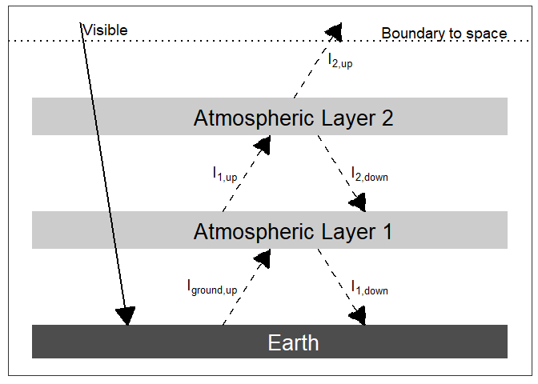
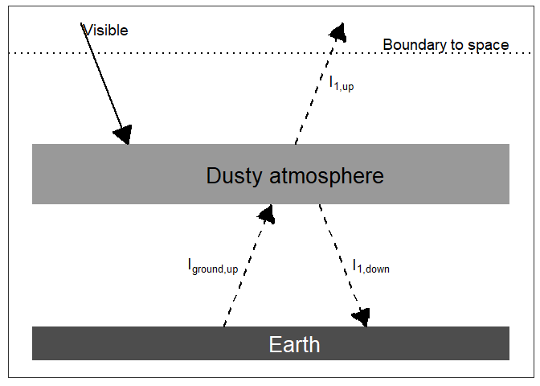

EES 3310/5310 Lab \#1
================
put your name here
August 28, 2017

Exercise 2.1
============

Consider exercise 1 in Chapter 2, on p. 17 of our textbook, *Global Warming: Understanding the Forecast*:

> A joule (J) is an amount of energy, and a watt (W) is a rate of using energy, defined as 1 W = 1 J/s. How many Joules of energy are required to run a 100-W light bulb for one day?

``` r
seconds_per_hour = 60 * 60 # number of seconds in one hour
hours_per_day = 24 # number of seconds in one day
light_bulb_power = 100
joules_per_day = light_bulb_power * seconds_per_hour * hours_per_day

joules_per_day
```

    ## [1] 8640000

It can be hard to read a long number like that, so we can use R's format command to add commas:

``` r
format_md(joules_per_day, comma = TRUE)
```

    ## [1] "8,640,000"

A 100 watt light bulb burns 100 Joules per second, so the light bulb burns 3.6× 10<sup>5</sup> Joules per hour and 8.64× 10<sup>6</sup> Joules per day.

> Burning coal yields about 30 × 10<sup>6</sup> J of energy per kilogram of coal burned. Assuming that the coal power plant is 30% efficient, how much coal has to be burned to light that light bulb for one day?

``` r
joules_heat_per_kg_coal = 30.E+6
efficiency = 0.30
joules_electricity_per_kg_coal = joules_heat_per_kg_coal * efficiency
kg_coal_per_joule_electricity = 1 / joules_electricity_per_kg_coal
kg_coal_per_day = joules_per_day * kg_coal_per_joule_electricity

kg_coal_per_day
```

    ## [1] 0.96

1 kilogram of coal produces 3.0×10<sup>7</sup> joules of heat, which is converted into 9.0×10<sup>6</sup> joules of electricity. We can turn this around and figure that to get 1 joule of electricity takes 1 / (9.0×10<sup>6</sup>) = 1.1×10<sup>-7</sup> kg of coal, so to get 8.6×10<sup>6</sup> joules of electricity to power the light bulb for one day takes 0.96 kg of coal.

Exercise 2.2
============

> A gallon of casoline carries with it about 1.3 × 10<sup>8</sup> J of energy. Given a price of $3 per callon, how many Joules can you get for a dollar?

``` r
# Put your R code here to answer the question
# 
```

> Electricity goes for about $0.05 per kilowatt hour. A kilowatt hour is just a weird way to write Joules because a watt is a joule per second, and a kilowatt hour is the number of Joules one would get from running 1000 W time one hour (3,600 seconds). In the form of electricity, how many Joules can you get for a dollar?

``` r
# Put your R code here to answer the question
```

> A standard cubic foot of natural gas carries with it about 1.1 × 10<sup>6</sup> Joules of energy. You can get about 5 × 10<sup>5</sup> British Thermal Units (BTUs) of gas for a dollar, and there are about 1,030 BTUs in a standard cubic foot. How many Joules of energy in the form of natural gas can you get for a dollar?

``` r
# Put your R code here to answer the question
```

> A ton of coal holds about 3.2 × 10<sup>10</sup> J of energy and costs about $40. How many Joules of energy in the form of coal can you get for a dollar?

``` r
# Put your R code here to answer the question
```

> Corn oil costs about $0.10 per fluid ounce wholesale. A fluid ounce carries about 240 dietary Calories (which a scientist would call kilocalories). A dietary Calorie is about 4200 J. How many Joules of energy in the form of corn oil can you get for a dollar?

``` r
# Put your R code here to answer the question
```

> Rank these five energy sources from cheap to expensive. What is the range of prices?

Exercise 2.3 (Grad students only)
=================================

> This is one of those job-interview questions to see how creative you are, analogous to one I heard: "How many airplanes are over Chicago at any given time?" You need to make stuff up to get an estimate and demonstrate your management potential. The question is: *What is the efficiency of energy production from growing corn?*
>
> Assume that sunlight deposits 250 W/m<sup>2</sup> of energy on a corn field, averaging over the day-night cycle. There are approximately 4,200 J per dietary Calorie. How many Calories of energy are deposited on a square meter of field over the growing season?
>
> (Note: the word "calorie" has two different meanings. Physicists and chemists, use "calorie" (with a lower-case "c") to refer to a thermodynamic unit of heat, but nutritionists use the word Calorie (with a capital 'C') to mean 1 kilocalorie (1000 thermodynamic calories), so when you see "Calories" on a food label, it means kilocalories. To keep this exercise simple, I have edited the textbook version so we only need to think in terms of dietary Calories.)

``` r
# Put your R code here to answer the question
```

> Now guess how many ears of corn grow per square meter, and guess what the number of dietary Calories is that you get for eating an ear of corn. Compare the sunlight energy with the corn energy to get the efficiency.

Exercise 2.4
============

> The Hoover Dam produces 2 × 10<sup>9</sup> W of electricity. It is composed of 7 × 10<sup>9</sup> kg of concrete. Concrete requires 1 MJ of energy (1 megajoule, 1,000,000 Joules) to produce per kilogram. How much energy did it take to produce the dam? How long is the "energy payback time" for the dam?

``` r
# Put your R code here to answer the question
```

> The area of Lake Mead, formed by Hoover Dam, is 247 mi<sup>2</sup>. Assuming 250 W/m<sup>2</sup> of sunlight falls on Lake Mead, how much energy could you produce if instead of the lake you installed solar cells that were 12% efficient? (1 mile is 1609 meters; how many square meters are in a square mile?)

``` r
# Put your R code here to answer the question
```

Exercise 2.5
============

> It takes approximately 2 × 10<sup>9</sup> J of energy to manufacture 1 m<sup>2</sup> of crystalline-silicon photovoltaic cell. (Actually, the number quoted was 600 kWhr. Can you figure out how to convert kilowatt hours into Joules?) Assume that the solar cell is 12% efficient, and calculate how long it would take, given 250 W/m<sup>2</sup> of sunlight, for the solar cell to repay the energy it cost for its manufacture.

``` r
# Put your R code here to answer the question
```

Exercise 2.7
============

> Infrared light has a wavelength of about 10 *μ*m. What is its wave number in cm<sup>−1</sup>?

``` r
# Put your R code here to answer the question
```

> Visible light has a wavelength of about 0.5 *μ*m. What is its frequency in Hz (cycles per second)?

``` r
# Put your R code here to answer the question
```

> FM radio operates at a frequency of about 40 kHz. What is its wavelength?

``` r
# Put your R code here to answer the question
```

Exercise 3.1 (Grad. students only)
==================================

> **The moon with no heat transport.** The Layer Model assumes that the temperature of the body in space is all the same. This is not really very accurate, as you know that it is colder at the poles than it is at the equator. For a bare rock with no atmosphere or ocean, like the moon, the situation is even worse because fluids like air and water are how heat is carried around on the planet. So let us make the other extreme assumption, that there is no heat transport on a bare rock like the moon. Assume for comparability that the albedo of this world is 0.30, same as Earth’s.
>
> What is the equilibrium temperature of the surface of the moon, on the equator, at local noon, when the sun is directly overhead? (Hint: First figure out the intensity of the local solar radiation I<sub>solar</sub>)

``` r
# Put your R code here to answer the question
```

> What is the equilibrium temperature on the dark side of the moon?

``` r
# Put your R code here to answer the question
```

Exercise 3.2
============

**A Two-Layer Model.** Insert another atmospheric layer into the model, just like the first one. The layer is transparent to visible light but a blackbody for infrared.

``` r
make_layer_diagram(2)
```



1.  Write the energy budgets for both atmospheric layers, for the ground, and for the Earth as a whole, like we did for the One-Layer Model.

``` r
# Put your R code here to answer the question
```

1.  Manipulate the budget for the Earth as a whole to obtain the temperature T<sub>2</sub> of the top atmospheric layer, labeled Atmospheric Layer 2 in the figure above. Does this part of the exercise seem familiar in any way? Does the term ring any bells?

``` r
# Put your R code here to answer the question
```

1.  Insert the value you found for T<sub>2</sub> into the energy budget for layer 2, and solve for the temperature of layer 1 in terms of layer 2. How much bigger is T<sub>1</sub> than T<sub>2</sub>?

``` r
# Put your R code here to answer the question
```

1.  Now insert the value you found for T<sub>1</sub> into the budget for atmospheric layer 1 to obtain the temperature of the ground, T<sub>ground</sub>. Is the greenhouse effect stronger or weaker because of the second layer?

``` r
# Put your R code here to answer the question
```

Exercise 3.3
============

``` r
make_nuclear_winter_diagram()
```



> **Nuclear Winter.** Let us go back to the One-Layer Model but change it so that the atmospheric layer absorbs visible light rather than allowing it to pass through (See the figure above). This could happen if the upper atmosphere were filled with dust. For simplicity, assume that the albedo of the Earth remains the same, even though in the real world it might change with a dusty atmosphere. What is the temperature of the ground in this case?

``` r
# Put your R code here to answer this question.
```
