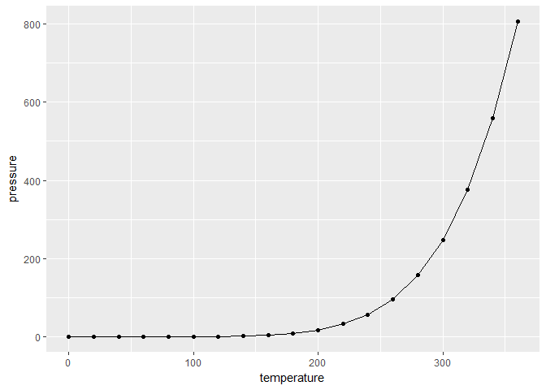

# Test Lab Assignment
Jonathan Gilligan  
August 17, 2017  


## R Markdown

This is an R Markdown document. Markdown is a simple formatting syntax for authoring HTML, PDF, and MS Word documents. For more details on using R Markdown see <http://rmarkdown.rstudio.com>.

When you click the **Knit** button a document will be generated that includes both content as well as the output of any embedded R code chunks within the document. You can embed an R code chunk like this:


```r
summary(cars)
```

```
##      speed           dist       
##  Min.   : 4.0   Min.   :  2.00  
##  1st Qu.:12.0   1st Qu.: 26.00  
##  Median :15.0   Median : 36.00  
##  Mean   :15.4   Mean   : 42.98  
##  3rd Qu.:19.0   3rd Qu.: 56.00  
##  Max.   :25.0   Max.   :120.00
```

## Including Plots

You can also embed plots, for example:


```r
ggplot(pressure, aes(x = temperature, y = pressure)) + geom_point() + geom_line()
```

<!-- -->

## Using R for calculations

We can use R to do our calculations. Consider exercise 1 in Chapter 2 of our textbook, _Global Warming: Understanding the Forecast_:

> A joule (J) is an amount of energy, and a watt (W) is a rate of using energy, defined as 1 W = 1 J/s. How many Joules of energy are required to run a 100-W light bulb for one day?


```r
seconds_per_hour = 60 * 60 # number of seconds in one hour
hours_per_day = 24 # number of seconds in one day
light_bulb_power = 100
joules_per_day = light_bulb_power * seconds_per_hour * hours_per_day

joules_per_day
```

```
## [1] 8640000
```

It can be hard to read a long number like that, so we can use R's format command to add commas:


```r
format_md(joules_per_day, comma = TRUE)
```

```
## [1] "8,640,000"
```

A 100 watt light bulb burns 100 Joules per second, 
so the light bulb burns 3.6&times; 10^5^ Joules per hour and
8.64&times; 10^6^ Joules per day.

> Burning coal yields about 30 &times; 10^6^ J of energy per kilogram of coal burned. Assuming that the coal power plant is 30% efficient,
> how much coal has to be burned to light that light bulb for one day?


```r
joules_heat_per_kg_coal = 30.E+6
efficiency = 0.30
joules_electricity_per_kg_coal = joules_heat_per_kg_coal * efficiency
kg_coal_per_joule_electricity = 1 / joules_electricity_per_kg_coal
kg_coal_per_day = joules_per_day * kg_coal_per_joule_electricity

kg_coal_per_day
```

```
## [1] 0.96
```

1 kilogram of coal produces 3.0&times;10^7^ joules of heat, which is converted into 9.0&times;10^6^ joules of electricity.
We can turn this around and figure that to get 1 joule of electricity takes 1 / (9.0&times;10^6^) = 1.1&times;10^-7^ kg of coal,
so to get 8.6&times;10^6^ joules of electricity to power the light bulb for one day takes 0.96 kg of coal.


